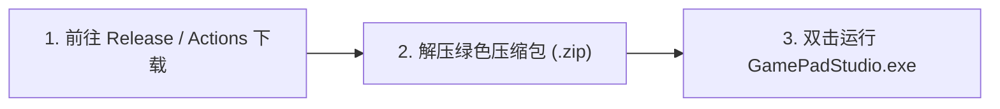

<div align="center">


# GamePad Studio

### 次时代 Windows 游戏手柄全功能工作台 · 300Hz 物理动态虚拟键鼠 · 全外设支持

<p align="center">
  <a href="https://github.com/lilymoonight/GamePadStudio/releases/latest">
    
  </a>
  <a href="https://github.com/lilymoonight/GamePadStudio/actions/workflows/build.yml">
    
  </a>
  
  
</p>

<p align="center">
  <b>为 PC 玩家打造的高性能、免配置手柄映射与触觉中枢。</b><br/>
  抛弃繁琐的按键代号与迟钝的模拟摇杆视角，享受如原生鼠标般细腻丝滑的 300Hz 物理镜头与全外设自由映射。
</p>

<p align="center">
  <a href="https://github.com/lilymoonight/GamePadStudio/releases/latest">
    
  </a>
  &nbsp;&nbsp;
  <a href="https://github.com/lilymoonight/GamePadStudio/actions">
    
  </a>
</p>

---


</div>

<br/>

## ✨ 核心产品特性

<table>
  <tr>
    <td width="50%">
      <h3>⌨️ 目标驱动型 ANSI 87 虚拟键鼠</h3>
      <p><b>“所见即所绑”的革命性交互</b>。工作台完整呈现标准 87 键键盘与电竞鼠标，点击任意虚拟按键，按下手柄或外设按钮即可秒速绑定。告别传统映射工具中令人头疼的 <code>Button 1..64</code> 冰冷代号。</p>
    </td>
    <td width="50%">
      <h3>🎯 300Hz 摄影机级物理动力学视角</h3>
      <p><b>告别摇杆视角撕裂与顿挫</b>。内置 1ms 高精度硬件时钟与二阶弹簧-质量-阻尼（Spring-Mass-Damper）质点动力学模型，模拟真实摄影机云台惯性加速与阻尼归位，配合边界无感守护，视角丝滑如德味云台。</p>
    </td>
  </tr>
  <tr>
    <td width="50%">
      <h3>🛡️ 硬件级设备隐身 (HidHide WHQL)</h3>
      <p><b>彻底消灭“双重输入 (Double Input)”与 UI 狂闪</b>。基于微软 WHQL 官方认证过滤驱动，一键向系统与游戏隐藏物理手柄硬件，仅输出纯净键鼠操作，不注入、不改内存，天然过各类游戏反作弊。</p>
    </td>
    <td width="50%">
      <h3>📸 机械快门音效与触觉拟真引擎</h3>
      <p><b>每一次捕获都有实体质感</b>。支持 DualSense 双路触觉反馈，为每一次截图与技能释放注入拟真机械震感；毫秒级并发播放经典机械快门声浪，让游戏抓拍极具沉浸感。</p>
    </td>
  </tr>
  <tr>
    <td width="50%">
      <h3>🕹️ 全外设穿透：手柄 / 飞行摇杆 / 模拟赛车</h3>
      <p>支持 DualSense、Xbox、Switch Pro，以及飞行摇杆（HOTAS）、节流阀与赛车方向盘/脚踏板。原生支持 0~63 号按键直通与摇杆全方位自适应解算，打破外设型号限制。</p>
    </td>
    <td width="50%">
      <h3>⏪ 4K HEVC 内存循环精彩瞬间回放</h3>
      <p>内置零磁盘磨损的内存循环录像服务，后台极低内存常驻。一键长按快速将过去 1~10 分钟的高光操作与绝美风景无损固化导出为 4K MP4 视频。</p>
    </td>
  </tr>
</table>

---

## 🚀 三步快速开始 (无需安装 Python)

本项目通过 **GitHub Actions CI/CD** 全自动打包构建，所有发布版本均经过 100% 自动化测试验证。



1. **下载程序**：进入 **[GitHub Releases 最新发布页](https://github.com/lilymoonight/GamePadStudio/releases/latest)**（或在 **[Actions 页面](https://github.com/lilymoonight/GamePadStudio/actions)** 下载最新夜间测试构件），下载 `GamePadStudio-Windows-x64.zip`；
2. **解压即用**：解压压缩包至电脑任意目录（纯绿色免安装，不修改系统注册表）；
3. **连接畅玩**：双击运行 `GamePadStudio.exe`，插入任意手柄外设即可自动识别！

> [!TIP]
> **可选功能：硬件级隐身驱动**  
> 若您游玩的 3D 游戏存在手柄与键鼠同时响应、UI 图标频繁闪烁的情况，可在工作台设置中点击开启 **「HidHide 硬件隐身」**。系统将一键屏蔽物理手柄，仅保留丝滑的虚拟键鼠输入。

---

## 🎮 外设兼容支持矩阵

| 硬件设备类型 | 代表设备型号 | 映射支持 | 触觉震动 | 驱动隐身 |
| :--- | :--- | :---: | :---: | :---: |
| **Sony PlayStation** | DualSense (PS5), DualSense Edge, DualShock 4 (PS4) | ✅ 原生免驱 | ✅ 拟真触觉 | ✅ 支持 |
| **Microsoft Xbox** | Xbox Series X\|S, Xbox One, Elite 2, Xbox 360 | ✅ 原生免驱 | ✅ 震动支持 | ✅ 支持 |
| **Nintendo Switch** | Switch Pro Controller, Joy-Con 配对 | ✅ 原生免驱 | ✅ 基础反馈 | ✅ 支持 |
| **专业飞行外设** | ECHO 飞行摇杆, Thrustmaster HOTAS, Saitek 节流阀 | ✅ 64 键穿透 | — | ✅ 支持 |
| **模拟赛车外设** | 罗技 G29/G923, 拓士 T300, 踏板及排挡 | ✅ 多轴自适应 | — | ✅ 支持 |
| **常规免驱手柄** | 北通、八位堂、飞智、第三方 DirectInput 摇杆 | ✅ 即插即用 | ✅ 基础震动 | ✅ 支持 |

---

## 📸 界面与工作台预览

<div align="center">

### 标准 ANSI 87 双区块独立对齐映射界面
*左侧标准主键盘区 + 右侧独立编辑/方向键区，精准几何对齐，点击任意按键即可开始捕获*
<br/>


<br/><br/>

### 微软 WHQL 官方认证 HidHide 设备屏蔽与状态监控
*绿色高亮呈现硬件隐身生效状态，杜绝游戏键位冲突*
<br/>


</div>

---

## 🕹️ 开箱即用的 3D 动作 / 开放世界通用映射方案

GamePad Studio 内置针对主流 3D 动作与开放世界游戏的优化预设：
* **智能启动器与桌面原生点击**：在桌面或启动器上，右摇杆无缝化身精准光标，A 键自适应为鼠标左键点击，一键启动游戏；进入游戏全屏窗口后自动切换为游戏内键位映射；
* **0ms 极速普攻**：RT 扳机模拟量一阶直通 `鼠标左键`，普攻/技能蓄力零延迟响应；
* **极速多层换挡 (Chord Keybinds)**：
  * 支持 `LB` / `LT` 搭配按键扩展多层技能或快捷槽位（例如即时切换装备、技能轮盘）；
  * 右摇杆 300Hz 动力学视角在镜头急速转动时稳定平滑，告别传统手柄视角摇晃。

---

<details>
<summary><b>👨‍💻 面向开发者：从源码构建与运行 (点击展开)</b></summary>
<br/>

如果您希望基于源码进行二次开发或参与共建，可使用以下步骤：

### 1. 环境准备
* 操作系统：Windows 10 / Windows 11 (64-bit)
* Python 版本：Python 3.10+

### 2. 克隆仓库与配置环境
```bash
git clone https://github.com/lilymoonight/GamePadStudio.git
cd GamePadStudio

# 创建并激活虚拟环境
python -m venv .venv
.\.venv\Scripts\activate

# 安装开发依赖
pip install -r requirements.txt
pip install pyinstaller pytest
```

### 3. 本地运行与测试
```bash
# 启动工作台
python main.py

# 运行自动化测试套件 (包含 77 个单元/集成测试)
pytest tests/
```

### 4. 本地打包发布版
```bash
pyinstaller --noconfirm GamePadStudio.spec
# 打包产物位于 dist/GamePadStudio/
```

</details>

---

## 📄 开源许可证

本项目基于 **[GNU General Public License v3.0 (GPLv3)](LICENSE)** 开源发布。  
任何人在使用、修改或分发本项目的衍生版本时，必须遵循 GPLv3 协议同样保持完全开源，严禁闭源商业化套壳。  
欢迎提交 [Issues](https://github.com/lilymoonight/GamePadStudio/issues) 与 [Pull Requests](https://github.com/lilymoonight/GamePadStudio/pulls) 参与贡献与建议！
