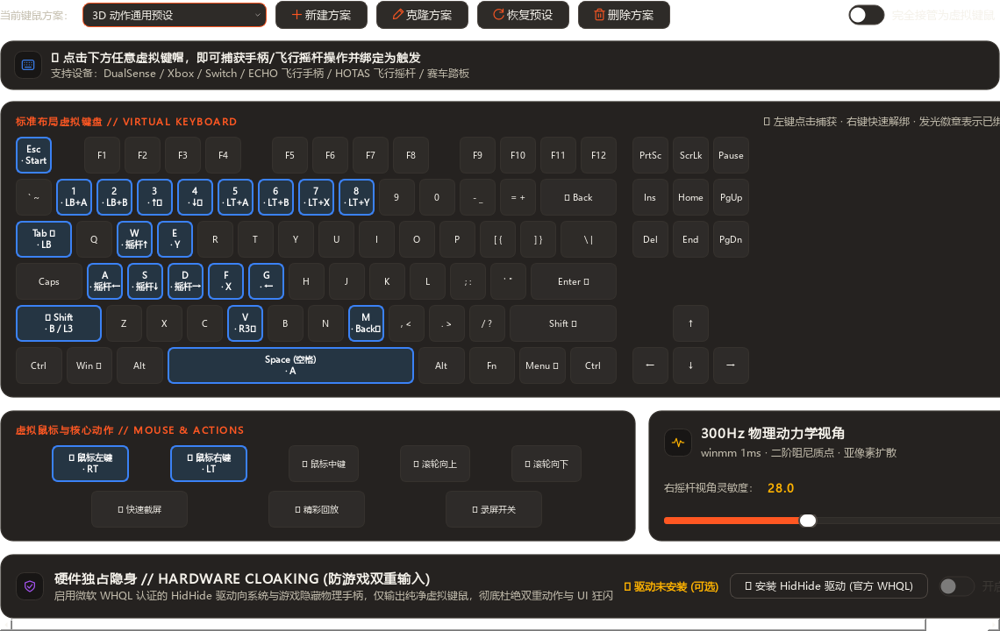
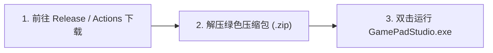
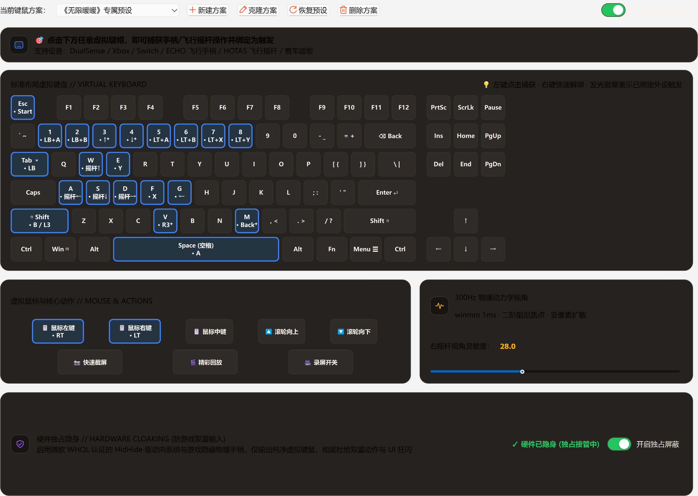

<div align="center">


# GamePad Studio

### 游戏手柄全功能工作台 · Windows 正式版 / macOS 适配预览

<p align="center">
  <a href="https://github.com/lilymoonight/GamePadStudio/releases/latest">
    
  </a>
  <a href="https://github.com/lilymoonight/GamePadStudio/actions/workflows/build.yml">
    
  </a>
  
  
  
</p>

<p align="center">
  <b>为 PC 玩家打造的高性能、免配置手柄映射与触觉中枢。</b><br/>
  抛弃繁琐的按键代号与迟钝的模拟摇杆视角，享受如原生鼠标般细腻丝滑的 300Hz 物理镜头与全外设自由映射。
</p>

<p align="center">
  <a href="https://github.com/lilymoonight/GamePadStudio/releases/latest">
    
  </a>
  &nbsp;&nbsp;
  <a href="https://github.com/lilymoonight/GamePadStudio/actions">
    
  </a>
</p>

---



</div>

<br/>

## ✨ 核心产品特性

<table>
  <tr>
    <td width="50%">
      <h3>⌨️ 目标驱动型 ANSI 87 虚拟键鼠</h3>
      <p><b>“所见即所绑”的革命性交互</b>。工作台完整呈现标准 87 键键盘与电竞鼠标，点击任意虚拟按键，按下手柄或外设按钮即可秒速绑定。告别传统映射工具中令人头疼的 <code>Button 1..64</code> 冰冷代号。</p>
    </td>
    <td width="50%">
      <h3>🎯 300Hz 摄影机级物理动力学视角</h3>
      <p><b>告别摇杆视角撕裂与顿挫</b>。内置 1ms 高精度硬件时钟与二阶弹簧-质量-阻尼（Spring-Mass-Damper）质点动力学模型，模拟真实摄影机云台惯性加速与阻尼归位，配合边界无感守护，视角丝滑如德味云台。</p>
    </td>
  </tr>
  <tr>
    <td width="50%">
      <h3>🛡️ 硬件级设备隐身 (HidHide WHQL)</h3>
      <p><b>彻底消灭“双重输入 (Double Input)”与 UI 狂闪</b>。基于微软 WHQL 官方认证过滤驱动，一键向系统与游戏隐藏物理手柄硬件，仅输出纯净键鼠操作，不注入、不改内存，天然过各类游戏反作弊。</p>
    </td>
    <td width="50%">
      <h3>📸 机械快门音效与触觉拟真引擎</h3>
      <p><b>截图与回放保存都有反馈</b>。为支持普通震动的设备提供双通道脉冲，并可搭配机械快门音效。输出能力随实际设备和连接方式检测；不宣称完整音频触觉波形或游戏原生震动接管。</p>
    </td>
  </tr>
  <tr>
    <td width="50%">
      <h3>🕹️ 全外设穿透：手柄 / 飞行摇杆 / 模拟赛车</h3>
      <p>支持 DualSense、Xbox、Switch Pro，以及飞行摇杆（HOTAS）、节流阀与赛车方向盘/脚踏板。原生支持 0~63 号按键直通与摇杆全方位自适应解算，打破外设型号限制。</p>
    </td>
    <td width="50%">
      <h3>⏪ 4K HEVC 内存循环精彩瞬间回放</h3>
      <p>内置零磁盘磨损的内存循环录像服务，后台极低内存常驻。一键长按快速将过去 1~10 分钟的高光操作与绝美风景无损固化导出为 4K MP4 视频。</p>
    </td>
  </tr>
</table>

---

## 🚀 三步快速开始 (无需安装 Python)

以下下载步骤适用于 Windows 正式版。macOS 14+ 已提供源码运行与 `.app` 适配预览，使用原生键鼠、窗口截图、多屏捕获和 VideoToolbox，并保留应用关联、全局暂停与登录启动。手柄独占访问和项目内整段录像用于替代 Windows 系统功能，系统音轨正在集成验收；特殊键和真实虚拟手柄仍有明确缺口。源码需先构建 Swift 捕获组件，已打包应用无需 Xcode。启动、权限及实机步骤见 [macOS 支持说明](docs/MACOS_SUPPORT.md)，完整实现与验证边界见 [平台功能对齐矩阵](docs/MACOS_PARITY.md)。

本项目通过 **GitHub Actions CI/CD** 全自动打包构建，所有发布版本均经过 100% 自动化测试验证。



1. **下载程序**：进入 **[GitHub Releases 最新发布页](https://github.com/lilymoonight/GamePadStudio/releases/latest)**（或在 **[Actions 页面](https://github.com/lilymoonight/GamePadStudio/actions)** 下载最新夜间测试构件），下载 `GamePadStudio-Windows-x64.zip`；
2. **解压即用**：解压压缩包至电脑任意目录（纯绿色免安装，不修改系统注册表）；
3. **连接畅玩**：双击运行 `GamePadStudio.exe`，插入任意手柄外设即可自动识别！

工作台默认全屏启动。按 **F11** 切换全屏，按 **Esc** 返回窗口；缩小窗口后，导航与内容分组会自动调整排布。

配置与设备设置跟随当前选中的输入手柄，界面只显示该设备支持的选项；没有连接手柄时使用通用 XInput 公共配置。设备身份、同型号独立配置和旧配置备份规则见 [输入设备与配置归属](docs/DEVICE_BOUND_SETTINGS.md)。

连接手柄后，可在预设「更多设置 → 应用关联」选择游戏实际运行的 `.exe` 和此手柄的预设，再启用自动切换。进入应用时自动生效，离开后恢复手动预设；编辑和安全试按时保持当前预设，暂停不会恢复输出。重新选择当前预设或使用「设为手动预设」可覆盖本次应用匹配，直到前台应用变化。功能默认关闭，按完整路径匹配，不猜测游戏名称；权限不足时安全回退。研究与逐轮验收见 [持续推进记录](docs/continuous-progress.md)。

预设「更多设置」同时提供「导出此预设」和「导入预设」。便携 `.gpsprofile.json` 文件保存当前预设的绑定与操作手感；导入前显示可用和跳过的绑定，确认后创建当前设备的新预设并保留现有生效方案。跨品牌沿用按键物理位置，型号专属键及缺失输入整组跳过，原始 DirectInput 外设仅适配相同型号。不携带设备身份、应用路径、系统设置或启动命令；文件格式、大小及参数均须通过校验。

「操作手感 → 视角与指针 → 垂直视角方向」可选择常规或反转。仅右摇杆的游戏镜头反转，桌面指针保持常规方向；设置按当前设备预设保存，也随便携文件导入、导出。没有右摇杆的设备隐藏此设置。

实际报告电池电量的设备在「硬件交互与反馈」中提供低电量提醒开关，按设备保存。持续低电量或极低电量会显示一次提示和托盘通知，降到极低时再提醒；恢复中等以上电量或外接供电后重新判断。未知电量和外接供电不会误报，不估算百分比。工作台最小化时仍可提醒；完全退出后停止提醒，系统是否显示通知取决于 Windows 通知设置。

「系统服务与开机启动 → 紧急暂停」可启用物理键盘快捷键，默认关闭，建议使用 `Ctrl+Alt+F10`。后台成功注册后，游戏前台也可以暂停软件的键鼠映射，并保留暂停状态；恢复需要在工作台手动操作。被其他程序占用或后台离线会明确显示未生效，完全退出时注销。该功能依赖正常运行的后台与 Windows 桌面消息，不替代系统安全操作。

「硬件遥测 → 右摇杆 → 静止测量」可在松手后测量偏移和波动，给出居中容错建议。测量使用连续新输入，移动、数据停更、断线或换设备时失效；过大的偏移或波动不提供可应用建议。测量本身不写配置，明确选择此手柄的键鼠预设并应用后，只调整该预设的右摇杆容错，保留其他手感与绑定。这是软件补偿，不修改手柄固件。

控制器「当前按键」和键鼠「详细列表」的「交换」可以一次互换两个输入的完整短按、长按和识别时长。确认前显示两边当前与交换后的结果；设备、绑定或时长变化会使旧预览失效。触摸手势之间可以交换，持续按键之间可以交换；两类来源不能混合互换。交换保留其他绑定、手感及当前生效预设。

硬件设置提供模拟扳机输入曲线及各震动通道的强度响应曲线，支持预设、拖动控制点、行程范围和未保存曲线试听。曲线按当前设备保存，仅影响本软件的映射和反馈；数字扳机不显示连续曲线，独立扳机震动需能力检测且默认关闭。主流设备、连接模式和官方依据见 [手柄曲线能力与生效范围](docs/CONTROLLER_CURVES.md)。

在手柄映射页点击图上的 L2／R2（Xbox 为 LT／RT，Switch 为 ZL／ZR）即可编辑扳机绑定。曲线入口同时提供在手柄映射页和键盘页的「曲线」菜单中，仅显示当前设备支持的通道。

连接实际提供触摸输入的手柄后，可从键盘页「触摸板」、设备概览或设置打开手势配置。轻触、双击、按住、四向滑动、双指轻触与双指滚动上下共 **10 种动作均可作为映射来源**；识别后可以直接绑定，也可以在普通映射编辑器中选择或录入手势。支持识别灵敏度和安全试用，设置按设备保存、动作按该设备的映射预设保存；双指选项仅在真实容量支持时显示。单指鼠标与未绑定方向的直接滚动有独立开关，触摸板实体按下保留独立映射。《无限暖暖》v3 提供专属触摸默认布局，具体能力与验证范围见 [触摸板手势](docs/CONTROLLER_TOUCH_GESTURES.md)。

录制按每帧实际时间保持播放时长；HDR 保留浮点亮度后转换为 SDR，多屏刷新率不同或未知时禁用“全部屏幕”录制。截图和回放的范围独立设置，性能与验证范围见 [录制颜色、时间轴与多屏限制](docs/RECORDING_COLOR_AND_TIMING.md)。

> [!TIP]
> **可选功能：硬件级隐身驱动**  
> 若您游玩的 3D 游戏存在手柄与键鼠同时响应、UI 图标频繁闪烁的情况，可在工作台设置中点击开启 **「HidHide 硬件隐身」**。系统将一键屏蔽物理手柄，仅保留丝滑的虚拟键鼠输入。

---

## 🎮 外设兼容支持矩阵

| 硬件设备类型 | 代表设备型号 | 映射支持 | 触觉震动 | 驱动隐身 |
| :--- | :--- | :---: | :---: | :---: |
| **Sony PlayStation** | DualSense (PS5), DualSense Edge, DualShock 4 (PS4) | ✅ 原生免驱 | ✅ 拟真触觉 | ✅ 支持 |
| **Microsoft Xbox** | Xbox Series X\|S, Xbox One, Elite 2, Xbox 360 | ✅ 原生免驱 | ✅ 震动支持 | ✅ 支持 |
| **Nintendo Switch** | Switch Pro Controller, Joy-Con 配对 | ✅ 原生免驱 | ✅ 基础反馈 | ✅ 支持 |
| **专业飞行外设** | ECHO 飞行摇杆, Thrustmaster HOTAS, Saitek 节流阀 | ✅ 64 键穿透 | — | ✅ 支持 |
| **模拟赛车外设** | 罗技 G29/G923, 拓士 T300, 踏板及排挡 | ✅ 多轴自适应 | — | ✅ 支持 |
| **常规免驱手柄** | 北通、八位堂、飞智、第三方 DirectInput 摇杆 | ✅ 即插即用 | ✅ 基础震动 | ✅ 支持 |

---

## 📸 界面与工作台预览

<div align="center">

### 标准 ANSI 87 双区块独立对齐映射界面
*左侧标准主键盘区 + 右侧独立编辑/方向键区，精准几何对齐，点击任意按键即可开始捕获*
<br/>


<br/><br/>

### 微软 WHQL 官方认证 HidHide 设备屏蔽与状态监控
*绿色高亮呈现硬件隐身生效状态，杜绝游戏键位冲突*
<br/>


</div>

---

## 🕹️ 《无限暖暖》专属键鼠预设

GamePad Studio 的键鼠页面仅保留《无限暖暖》专属预设，支持编辑按键并另存预设。新版布局按基础行动、探索、能力与菜单分组：

* **移动与战斗**：左摇杆轻推保持 Ctrl 慢走，推深正常跑；南 / 东 / 西 / 北面键对应跳跃、冲刺、交互、奇想战技 1，RB 对应下落攻击，L3 对应战技 2。
* **独立鼠标输入**：LT 保持鼠标右键，RT 保持鼠标左键；两只扳机不作为组合前缀，按下和释放无需等待短按 / 长按判定。右摇杆控制镜头或光标，用 RT 点击菜单和启动器。
* **探索与换装**：按住十字键↑打开能力轮盘，配合右摇杆和 RT 选择；先按住 LB，再轻点面键 / 十字键切换 1–8 能力槽，按住相同位置 0.50 秒切换 F1–F7 常用搭配。
* **触摸板直达**：单指左滑衣柜 C、右滑背包 B、上滑任务 U、下滑地图 M；轻触 T 任务追踪、双击 P 大喵相机、按住 CapsLock 功能汇总、双指轻触 V 大喵视角。双指滚动上下独立绑定滚轮，每格触发一次，也可改成其他动作。仅根据当前设备真实能力安装可用来源。
* **功能菜单**：有对应触摸手势时，Create + 面键不再重复短按打开衣柜 / 背包 / 任务，保留 0.60 秒的服装进化 / 奇想手账 / 设计图等次级功能；没有触摸板的手柄保留完整 Create / View 菜单层。单独轻点 Create / View 仍保存回放。

完整布局、阈值、操作来源及待核对项目见 [《无限暖暖》布局与按键依据](docs/INFINITY_NIKKI_LAYOUT.md)。本轮检索包含 2026 年资料，尚未在当前 2.9 客户端逐项实机核对，游戏内改键或版本差异可在映射页面调整。

已有 v2 专属预设会升级到布局 v3，升级前原配置保存为同目录的 `studio.before-nikki-layout-v3.json`。升级根据旧默认逐项比对，保留已经修改的绑定与手感参数；真实设备支持触摸后再补充对应来源。首次安装触摸布局推荐开启手势、关闭单指鼠标与直接滚动、使用 40% 灵敏度，并保留已修改的鼠标模式与灵敏度；之后不会反复启用用户关闭的手势。历史 v2 备份继续保留。

---

<details>
<summary><b>👨‍💻 面向开发者：从源码构建与运行 (点击展开)</b></summary>
<br/>

如果您希望基于源码进行二次开发或参与共建，可使用以下步骤：

### 1. 环境准备
* 操作系统：Windows 10 / Windows 11 (64-bit)
* Python 版本：Python 3.10+

### 2. 克隆仓库与配置环境
```bash
git clone https://github.com/lilymoonight/GamePadStudio.git
cd GamePadStudio

# 创建并激活虚拟环境
python -m venv .venv
.\.venv\Scripts\activate

# 安装开发依赖
pip install -r requirements.txt
pip install pyinstaller pytest
```

### 3. 本地运行与测试
```bash
# 启动当前 Python 源码，关闭同一配置的旧工作台并重新载入
.\Start Debug.cmd

# 或直接运行（已打开工作台时会唤起已有窗口）
python main.py --page mappings

# 运行完整单元与集成测试套件
pytest tests/
```

`Start Debug.cmd` 使用 `.venv` 和当前仓库源码，默认沿用 `%LOCALAPPDATA%\GamePadStudio` 的配置；可用 `--data-dir` 指定另一份配置。普通 `Start Studio.cmd` 优先打开安装版或已打包程序。

### 4. 本地打包发布版
```bash
pyinstaller --noconfirm GamePadStudio.spec
# 打包产物位于 dist/GamePadStudio/
```

</details>

---

## 📄 开源许可证

本项目基于 **[GNU General Public License v3.0 (GPLv3)](LICENSE)** 开源发布。  
任何人在使用、修改或分发本项目的衍生版本时，必须遵循 GPLv3 协议同样保持完全开源，严禁闭源商业化套壳。  
欢迎提交 [Issues](https://github.com/lilymoonight/GamePadStudio/issues) 与 [Pull Requests](https://github.com/lilymoonight/GamePadStudio/pulls) 参与贡献与建议！
