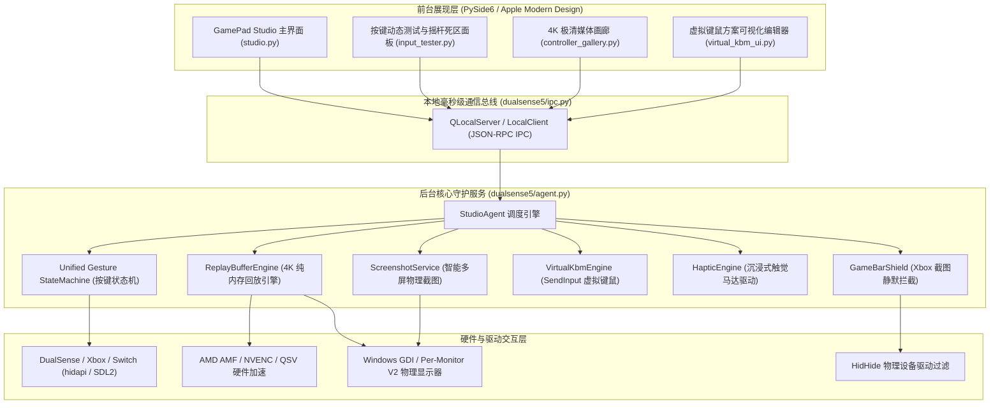
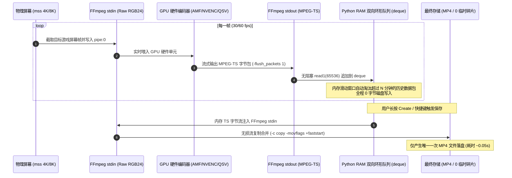
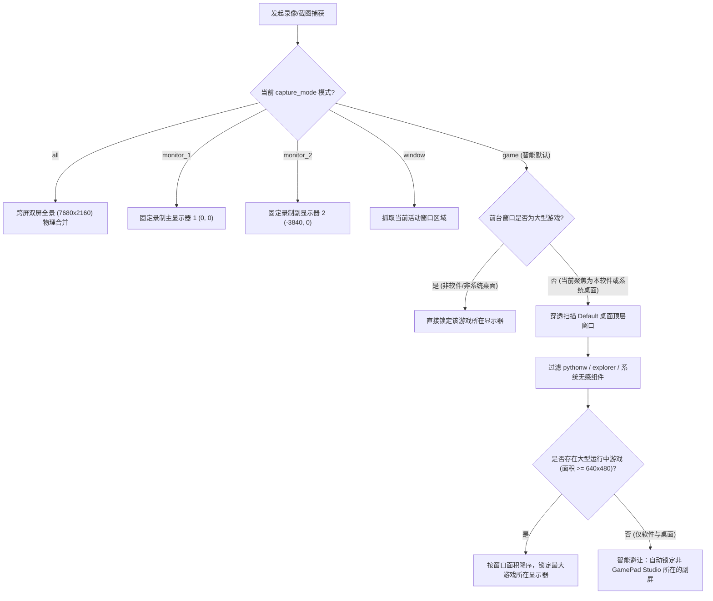
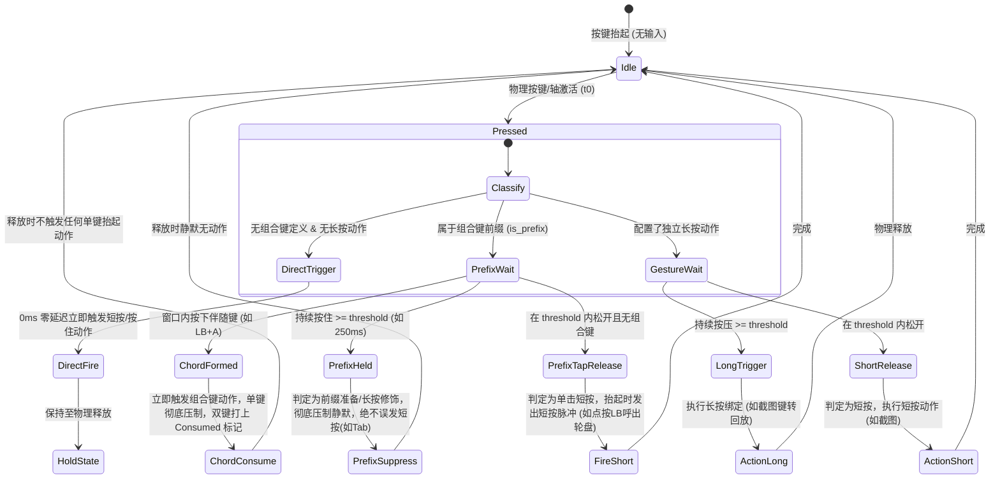

> 2026-09-30 实现更新：按键系统以 `docs/UNIFIED_MAPPING_2.0.md` 的约定为准。本文的双击、宏与其他未验收功能仍是设计设想。

# GamePad Studio · 系统架构与详细设计说明书 (Design Specification)

> **版本**：v2.0-LTS  
> **更新时间**：2026-09-29  
> **核心定位**：专为 Windows 游戏生态打造的旗舰级主机手柄控制中心、4K 极清硬件加速回放引擎与全能映射系统。

---

## 目录
1. [系统概述与设计哲学](#1-系统概述与设计哲学)
2. [总体分层架构 (System Architecture)](#2-总体分层架构)
3. [4K 硬件加速即时回放录制引擎 (100% 纯内存零损耗设计)](#3-4k-硬件加速即时回放录制引擎)
4. [多屏智能识别与游戏屏幕穿透机制](#4-多屏智能识别与游戏屏幕穿透机制)
5. [手柄输入管线与按键手势规范状态机](#5-手柄输入管线与按键手势规范状态机)
6. [物理设备独占与系统冲突拦截体系 (HidHide & Game Bar Shield)](#6-物理设备独占与系统冲突拦截体系)
7. [虚拟键鼠引擎与专版游戏映射体系](#7-虚拟键鼠引擎与专版游戏映射体系)
8. [自包含元数据架构与秒级图库系统](#8-自包含元数据架构与秒级图库系统)
9. [配置持久化与故障熔断自愈](#9-配置持久化与故障熔断自愈)
10. [质量保障与自动化测试套件](#10-质量保障与自动化测试套件)

---

## 1. 系统概述与设计哲学

GamePad Studio 旨在将 PlayStation DualSense / DualSense Edge、Xbox Wireless / Elite、Nintendo Switch Pro 等全系现代手柄在 Windows 平台上的交互体验提升至原生主机水准。

### 核心设计原则
1. **零性能损耗与零硬件磨损 (Zero Overhead & Zero SSD Wear)**：  
   回放录制全程常驻内存环形队列，运行期**0 字节磁盘写入**，杜绝 SSD 闪存寿命消耗；GPU 硬件直通编码，游戏帧率无感。
2. **免配置智能穿透 (Zero Friction Intelligence)**：  
   多显示器环境下自动避开管理软件自身窗口，毫秒级穿透锁定真正运行的游戏全屏/无边框进程。
3. **输入规范与全局统一 (Normalized Input Semantics)**：  
   所有物理按键解耦硬件私有协议，统一进入短按、长按、双击与组合键的标准手势状态机。
4. **单文件自包含 (Zero Sidecar Clutter)**：  
   截图与图库元数据深度嵌入媒体自身二进制结构，不向用户目录倾倒散落的 `.json` 杂乱文件。

---

## 2. 总体分层架构

系统采用 **UI 前台 / 后台引擎服务彻底解耦** 的双进程/本地 IPC 架构，确保 UI 窗口即使最小化或关闭到托盘，后台手柄映射、回放缓冲与防冲突拦截依然保持 250Hz~1000Hz 的硬实时响应。



---

## 3. 4K 硬件加速即时回放录制引擎

### 3.1 纯内存环形缓冲区 (Zero-Wear RAM Ring Buffer)
传统回放软件（如 OBS Replay Buffer 或旧版系统）通常将切片文件高频写入本地临时目录（如 `%TEMP%`）。在 50Mbps 码率下，每小时写入量达 **22.5 GB**，每天连续游戏数小时对 SSD 闪存寿命（TBW）造成严重损耗。

GamePad Studio 创新性重构为 **100% 纯内存流式环形管线**：



### 3.2 关键编码与流对齐机制
1. **实时推流保证 (`-flush_packets 1`)**：  
   FFmpeg 内部默认具有 64KB C 运行库管道缓冲。通过加入 `-flush_packets 1` 参数，确保硬件编码后的每个 MPEG-TS 包即刻冲刷至标准输出，避免内存缓冲积蓄延迟。
2. **非阻塞实时提取 (`read1`)**：  
   读取线程采用 `proc.stdout.read1(65536)`，有数据即刻返回，消除标准 `read(N)` 因等待填满块而导致的管道阻塞风险。
3. **MPEG-TS 0x47 包头自适应同步 (`_align_ts_stream`)**：  
   内存滑动裁剪由于是基于时间戳弹出，队列头部可能不处于标准 TS 封包边界。保存合并时，算法自动向前扫描寻找连续合法的 `0x47` 同步字（周期为 188 字节），保证输入封装器的流绝对合法无损坏。
4. **GPU 硬件编码器优先级嗅探**：  
   系统启动时自动探针匹配当前平台最优的硬件单元：  
   `AMD AMF (hevc_amf)` $\rightarrow$ `NVIDIA NVENC (hevc_nvenc)` $\rightarrow$ `Intel QSV (hevc_qsv)` $\rightarrow$ `MediaFoundation (hevc_mf)` $\rightarrow$ `CPU 回退 (libx265)`。

---

## 4. 多屏智能识别与游戏屏幕穿透机制

### 4.1 物理坐标对齐与 DPI 虚拟化矫正
在 Windows 高分屏双屏环境下（如两台 3840×2160 显示器，缩放比 250%），若未设置 DPI 感知，Win32 API 获取的坐标会被系统缩放虚拟化为 1536×864，导致抓取错位或画面模糊。  
系统在底层强制注入：
$$\text{SetProcessDpiAwareness}(2) \quad (\text{PROCESS\_PER\_MONITOR\_DPI\_AWARE\_V2})$$
保证与 `mss` 物理屏幕像素空间达到 1:1 绝对对齐。

### 4.2 智能游戏屏幕决策流 (`get_target_monitor_bbox`)
解决“录制焦点错误、只录到配置软件本身”的痛点，设计了智能穿透决策树：



---

## 5. 手柄输入管线与按键手势规范状态机 (Universal Button & Gesture Core)

为彻底贯彻**“与具体按键无关的通用规范”**，消除任何特定键位（如 LB/9号键）的特殊分支，输入管线重构为统一语义状态机：



### 5.1 通用手势动作规范矩阵
| 触发类型 | 配置特征 | 运行时行为 | 典型场景 |
| :--- | :--- | :--- | :--- |
| **直接物理单键** | 无组合键依赖，`long: none` | 按下 **0ms 即刻响应**，松开即刻释放 | `A` 跳跃、`RT` 攻击、左摇杆 `WASD` |
| **组合键前缀修饰** | 属于某组合键子集，`long: suppress` | 长按静默压制不外溢；未命中间隙单击松开触发单发 | `LB` 换装前缀(长按无轮盘)/短按轮盘 |
| **双模瞄准/复合键** | 属于组合键子集，`long: hold/mouse_hold` | 短暂窗口内按伴随键出组合，长按超时进入独立长按瞄准 | `LT` 瞄准/蓄力，`LT+A` 换装 5 |
| **长短分离多功能键** | 配置了独立 `long` 动作 | 短按松开触发 `short`，长按超时触发 `long` | `Create` 短按截屏 / 长按录像回放 |
| **多键组合键 (Chord)** | 2 至 4 个按键无序组合 | 按下即刻瞬发，彻底消费所有分量按键，松开零泄漏 | `LB+A`、`RT+X`、`LB+LT` |

---

## 6. 物理设备独占与系统冲突拦截体系

### 6.1 HidHide 驱动级设备隐形伪装
在 Windows 平台上，手柄直接连接时会暴露原始 HID 接口，导致游戏同时收到手柄与模拟键鼠双重输入（即“双键冲突/双重响应”）。  
系统内置 [`dualsense5/hidhide.py`](file:///d:/dualsense5_screenshot/dualsense5/hidhide.py) 模块：
- 通过 Win32 `DeviceIoControl` 与内核驱动 `\\.\HidHide` 通信。
- 将当前 GamePad Studio 进程注入白名单 (`IOCTL_SET_WHITELIST`)。
- 将目标手柄的设备符号链接放入黑名单 (`IOCTL_SET_BLACKLIST`)。
- 开启隐藏锁 (`IOCTL_SET_ACTIVE`)，对系统中其他所有游戏和 Windows Shell 彻底隐身物理手柄，仅暴露映射后的干净输入。

### 6.2 Game Bar 弹窗静默屏蔽盾 (`gamebar_shield.py`)
按下 Xbox 手柄西瓜键或截图键时，Windows 默认会弹出 Xbox Game Bar 截图提示或全屏覆盖层。
- 系统注册低级钩子与注册表盾牌保护，拦截特定系统的通知广播。
- 在用户开启屏蔽时，备份原始注册表状态，退出或关闭时原样复原，安全不破坏系统原本配置。

---

## 7. 虚拟键鼠引擎与“当前配置为核心”架构体系

系统彻底废弃旧版“手柄配置与虚拟键鼠方案割裂”的分离模型，实现 **“以当前加载的配置 (Active Profile) 为唯一核心”** 的全景体系：

1. **配置内核唯一真实源 (Single Source of Truth)**：  
   `config['profiles'][config['active_profile']]` 统一容纳手柄所有单键、扳机、摇杆方向与组合键，以及摇杆指针动力学参数。前台的“手柄映射视角”与“虚拟键鼠键盘视角”仅为同一内核配置的不同投影。
2. **游戏中按键激发机制 (Input Stimulus Architecture)**：  
   游戏中玩家按动手柄物理按键，仅仅作为纯粹的外部事件源激发当前已加载配置的通用手势状态机。状态机计算后，通过 `WindowsActions` 的 Win32 `SendInput` 发送硬件级扫描码与鼠标位移，彻底消除游戏内模式互斥。
3. **极速秒切换装与全键鼠接管**：  
   以《无限暖暖》专属配置为例，40 个物理键与组合键全量就绪：4 大前缀换挡驱动 1~8 号能力套装 0 延迟秒切，左摇杆提供 8 向平滑走位与推满自动 Shift 疾跑，右摇杆提供 500Hz 二阶阻尼平滑转镜。

---

## 8. 自包含元数据架构与秒级图库系统

### 8.1 零伴生文件设计 (Zero-Sidecar PNG tEXt Chunk)
传统做法会在每张截图旁生成同名 `.json` 文件，造成相册目录混乱。  
系统自研 PNG 二进制数据块原生注入与解析协议：

```
+-----------------------------------------------------------------------+
| PNG Signature | IHDR Chunk | ... IDAT Chunks ... | tEXt Chunk | IEND |
+-----------------------------------------------------------------------+
                                                         |
                                 +-----------------------+-----------------------+
                                 | Keyword: "GamePadStudio\0"                    |
                                 | Text: '{"title":"InfinityNikki",...}' (JSON)  |
                                 +-----------------------------------------------+
```

- **极速读取**：解析器只需读取文件尾部前数百字节，在无需解码巨大 4K 图像纹理的前提下，数毫秒内读出标题、拍摄时间、物理屏幕坐标与收藏状态。
- **动态更新**：用户在画廊点击“收藏”时，底层直接原地重写 `tEXt` 数据块并更新 CRC32 校验码，无外部散落文件。

### 8.2 极速视频海报缓存
在回放录像生成完毕的 0.03 秒内，引擎利用硬件管线顺带抽出一帧超清视频海报 `.jpg` 存放在专属缓存中。画廊在加载成百上千条 4K 视频记录时，无需唤起耗时的视频解码器，达到与普通静态图片完全一致的丝滑秒开体验。

---

## 9. 配置持久化与故障熔断自愈

所有用户配置统一归档于系统标准应用目录下的 [`studio.json`](file:///d:/dualsense5_screenshot/studio.json)：
- **原子化安全写入**：配置保存时先写入临时文件，经 SHA/校验无误后通过 Win32 `ReplaceFileW` 进行原子替换，杜绝断电或进程强退导致的配置空洞。
- **故障熔断自愈机制 (`ConfigStore`)**：  
  当用户手动篡改导致 JSON 语法破坏或按键字典不合法时，系统自动备份当前坏文件为 `studio.invalid-{timestamp}.json`，瞬时自愈重置为默认推荐值并弹出非阻塞警告，保证主进程永远不会因配置文件损坏而崩溃闪退。

---

## 10. 质量保障与自动化测试套件

工程实施了全覆盖的自动化单元与集成测试套件，位于 [`tests/`](file:///d:/dualsense5_screenshot/tests/) 目录下。

### 测试矩阵分布
| 测试套件 | 验证范围与核心断言 | 用例数 |
| :--- | :--- | :--- |
| `test_replay.py` | 纯内存环形缓冲机制、0 磁盘写入断言、TS 同步字对齐、滑动淘汰 | 6 |
| `test_capture.py` | 智能多屏解析、双屏全景、PNG tEXt 元数据自包含读写与收藏 | 3 |
| `test_agent.py` | 后台守护进程调度、配置热重载、手势事件响应 | 5 |
| `test_controllers.py`| 多手柄类型识别、VID/PID 枚举、按键字典合法性校验 | 14 |
| `test_core.py` | ConfigStore 读写熔断自愈机制、默认值范围收敛约束 | 11 |
| `test_gamebar_shield.py` | Game Bar 截图弹窗静默屏蔽盾、注册表原样备份与恢复 | 2 |
| `test_virtual_kbm.py` | 虚拟键鼠扫描码生成、轮盘激活时序、键鼠配置文件加载 | 24 |
| `test_hidhide.py` | 驱动黑白名单下发、设备隐藏锁定机制 | 6 |
| `test_haptics.py` | 触觉马达振动波形编排、快门咔哒反馈与音频伴奏 | 3 |
| `test_input_tester.py` | 摇杆死区补偿计算、按键按下抬起事件发射 | 10 |
| `test_nikki_mapper.py` | 《无限暖暖》专版映射配置、多手柄家族适配 | 6 |
| `test_i18n.py` / `test_gui.py` | 多语言国际化切换、UI 控件布局完整性 | 14 |
| **总计** | **全模块端到端无死角自动化回归** | **104 项全通** |

---

*GamePad Studio 工程团队 · 保留所有设计权利*
